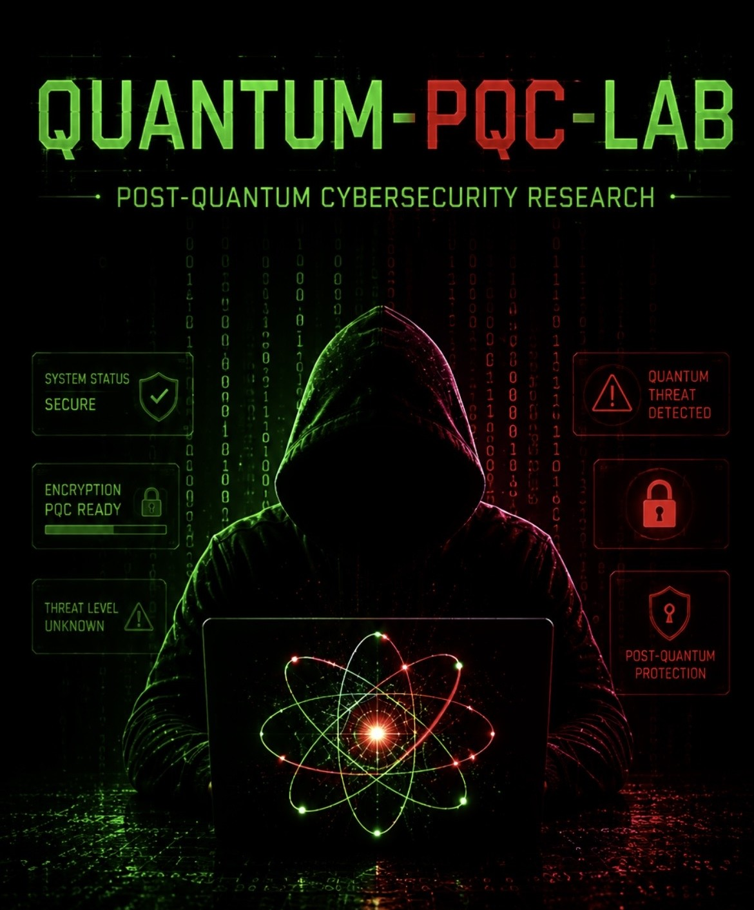
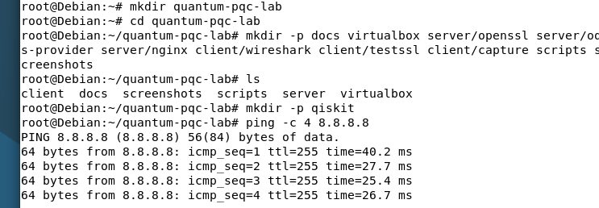
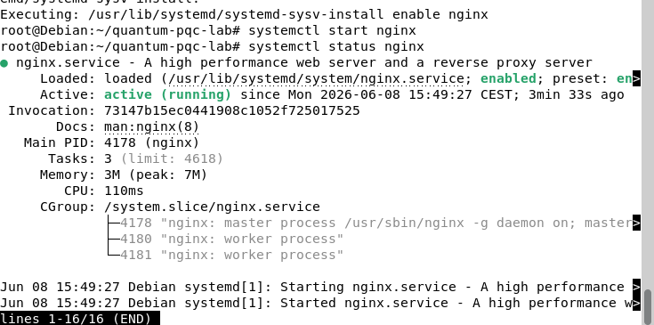
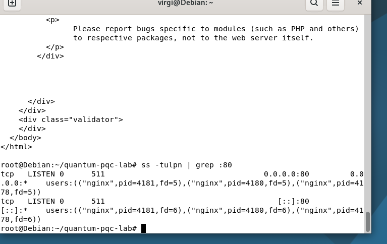

  

<h1 align="center">Quantum-PQC-Lab</h1>

  <strong>Laboratoire cybersécurité post-quantique - aperçu public</strong>

  Debian Server · Parrot Security · VirtualBox · TLS · OpenSSL · oqs-provider · Qiskit

---

## Aperçu public du projet

Quantum-PQC-Lab est un laboratoire pédagogique et technique autour de la cybersécurité post-quantique.

Ce dépôt public présente uniquement un aperçu du projet : objectif, architecture générale, environnement de test et état d’avancement.

La version complète du laboratoire contient les configurations détaillées, les scripts, les tests TLS, les captures réseau, les notebooks Qiskit et les supports pédagogiques.

---

## Objectif du projet

L’objectif est de créer un laboratoire reproductible afin de démontrer concrètement :

- les limites réelles des ordinateurs quantiques actuels ;
- les impacts possibles sur RSA et ECC ;
- les différences entre cryptographie classique et cryptographie post-quantique ;
- les ordres de grandeur liés aux algorithmes de Shor et Grover ;
- les mécanismes actuels de transition vers la cryptographie post-quantique ;
- le risque **Store Now, Decrypt Later**.

Le projet vise à vulgariser le sujet sans sensationnalisme, tout en s’appuyant sur des mécanismes techniques réels.

---

## Architecture générale du laboratoire

| Élément | Rôle | Services / outils | Objectifs |
|---|---|---|---|
| Machine hôte | Virtualisation | VirtualBox, 16 Go RAM recommandés, 4 vCPU minimum, 80 Go disque | Héberger les machines virtuelles du laboratoire |
| VM 1 - Debian Server | Serveur TLS | nginx ou apache, OpenSSL 3, liboqs, oqs-provider | Générer des certificats classiques et PQC, tester TLS classique et TLS hybride post-quantique, mesurer les impacts techniques |
| VM 2 - Parrot Security | Client de test et d’analyse | Wireshark, tcpdump, testssl.sh, openSSL client, nmap | Capturer les handshakes TLS, comparer RSA/ECC avec Kyber, observer les tailles de paquets et étudier les échanges réseau |
| VM 3 -  Qiskit Lab | Simulation pédagogique d’algorithmes quantiques | Python, Jupyter Notebook, Qiskit | Simuler Grover, simuler Shor sur de petits nombres, illustrer les contraintes quantiques réelles et les limites actuelles du hardware |

---

### Capture — structure du projet Debian

Cette capture montre la structure locale du projet créée sur Debian ainsi que la validation de l’accès Internet depuis la machine virtuelle.

---

## État d’avancement

Éléments déjà validés dans l’environnement de test :

- Debian installé et mis à jour ;
- Parrot Security installé et mis à jour ;
- accès Internet validé sur Debian ;
- accès Internet validé sur Parrot ;
- structure locale du projet créée sur Debian ;
- nginx installé sur Debian ;
- nginx actif sur Debian ;
- serveur HTTP Debian validé en local ;
- netcat-openbsd installé sur Parrot ;
- logique réseau VirtualBox validée ;
- choix final : Adapter 1 en réseau interne, Adapter 2 en NAT.

---

### Capture - nginx actif sur Debian

Cette capture montre que le service nginx est installé, lancé et actif sur la machine Debian Server.

## Aperçu réseau

La configuration réseau repose sur deux interfaces par machine virtuelle :

- une interface en réseau interne pour les échanges entre Debian et Parrot ;
- une interface NAT pour conserver l’accès Internet.

Cette configuration permet de construire un laboratoire isolé tout en gardant la possibilité d’installer les dépendances nécessaires.

---

### Capture - port 80 ouvert sur Debian

Cette capture montre que nginx écoute bien sur le port HTTP 80.

## Captures d’écran

Les captures disponibles dans ce dépôt montrent uniquement une partie de la configuration :

- aperçu de la configuration réseau VirtualBox ;
- validation de connectivité ;
- structure du projet sur Debian ;
- nginx actif sur Debian ;
- port HTTP ouvert sur le serveur Debian.

---

## Contenu non publié dans cette version

La version publique ne contient pas :

- les scripts complets ;
- les commandes avancées OpenSSL ;
- la configuration complète oqs-provider ;
- les certificats ;
- les tests TLS complets ;
- les captures Wireshark détaillées ;
- les benchmarks ;
- les notebooks Qiskit complets ;
- les exercices ;
- les corrections ;
- les supports de formation.

Ces éléments sont réservés à la version complète privée ou aux formations professionnelles.

---

## Version complète

La version complète du laboratoire comprend :

- configuration complète VirtualBox ;
- configuration Debian Server ;
- configuration Parrot Security ;
- OpenSSL 3 ;
- liboqs ;
- oqs-provider ;
- tests TLS classique vs post-quantique ;
- démonstration TLS hybride ;
- captures réseau Wireshark ;
- scripts de benchmark ;
- simulations Shor et Grover ;
- documentation complète ;
- supports de formation.

---

## Finalité du projet

Quantum-PQC-Lab a pour objectif de produire :

- un laboratoire reproductible ;
- un support pédagogique ;
- un portfolio cybersécurité ;
- une base de démonstration post-quantique ;
- une série de contenus techniques documentés pour GitHub, LinkedIn et la formation professionnelle.

---

## Accès complet

Pour obtenir la version complète du laboratoire ou organiser une formation professionnelle :

**Virginie Lechene**  
Site web : `ton-lien-site`  
Contact : `virginielechene@proton.me`

---

## Droits d’auteur

© Virginie Lechene. Tous droits réservés.

Ce dépôt est fourni uniquement comme aperçu public.  
Toute copie, redistribution, revente ou réutilisation sans autorisation est interdite.
